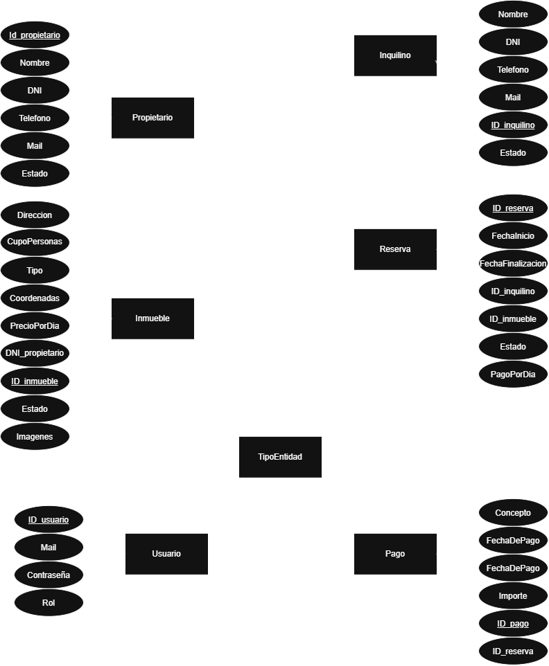

# Sistema de Gestión Inmobiliaria

> Aplicación web desarrollada con ASP.NET Core MVC para la gestión de una inmobiliaria.  
> En esta primera entrega se implementa el ABM (Alta, Baja y Modificación) de Propietarios e Inquilinos.

---

## 👥 Integrantes del Grupo

- **Antonio Tomas Assat** - GitHub: [AntonioAssat](https://github.com/AntonioAssat)
- **Ana Paula Quevedo** - GitHub: [Quevedoana](https://github.com/quevedoana)

---

## 🛠️ Tecnologías Utilizadas

- **C#**
- **ASP.NET Core MVC**
- **.NET 10**
- **MySQL**
- **DBeaver**
- **HTML / CSS**
- **Git**
- **GitHub**
- **Visual Studio Code**

---

## 📋 Primera Entrega

Para la primera entrega se desarrolló el **ABM de Propietarios e Inquilinos**, utilizando el patrón arquitectónico **MVC (Model-View-Controller)**.

### Propietarios

- Listado.
- Alta.
- Modificación.
- Baja.

### Inquilinos

- Listado.
- Alta.
- Modificación.
- Baja.

---

## 📋 Segunda Entrega

Para la segunda entrega se incorporó el **ABM de Inmuebles, Tipos de Inmueble y Reservas**.

### 🏠 Inmuebles

- Listado.
- Alta.
- Modificación.
- Baja y reactivación.
- Asociación con propietarios.
- Asociación con tipos de inmueble.

### 🏢 Tipos de Inmueble

- Listado.
- Alta.
- Modificación.
- Baja y reactivación.

### 📅 Reservas

- Listado.
- Alta.
- Modificación.
- Baja.
- Asociación entre inmueble e inquilino.

---

## 🏗️ Arquitectura

El proyecto utiliza el patrón **MVC (Model-View-Controller)**.

### Model

- `Propietario`
- `Inquilino`
- `Inmueble`
- `TipoInmueble`
- `Reserva`
- Repositorios correspondientes.

### Controller

- `HomeController`
- `PropietariosController`
- `InquilinosController`
- `InmueblesController`
- `TipoInmueblesController`
- `ReservasController`

### View

Vistas para:

- Listados.
- Altas.
- Modificaciones.
- Bajas.

---

## 🗄️ Base de Datos

El proyecto utiliza **MySQL** como sistema gestor de base de datos.

La aplicación utiliza repositorios para realizar las operaciones de acceso y modificación de los datos.

---

## 🖼️ Diagrama Entidad-Relación



---

## 🚀 Instalación y ejecución

### Requisitos

- .NET 10 SDK
- MySQL Server
- DBeaver
- Git

### Clonar el repositorio

```bash
git clone https://github.com/AntonioAssat/AnaYAntonio-ProyectoInmobiliaria.git
```

### Levantar la base de datos

1. Abrir **DBeaver** y conectarse al servidor **MySQL**.
2. Abrir el archivo `Inmobiliaria.sql`, ubicado en la raíz del proyecto.
3. Ejecutar el script completo.
4. Verificar que se haya creado correctamente la base de datos `Inmobiliaria` y sus tablas.

### Ejecutar el proyecto

Desde la carpeta del proyecto, ejecutar:

```bash
dotnet restore
dotnet build
dotnet run
```