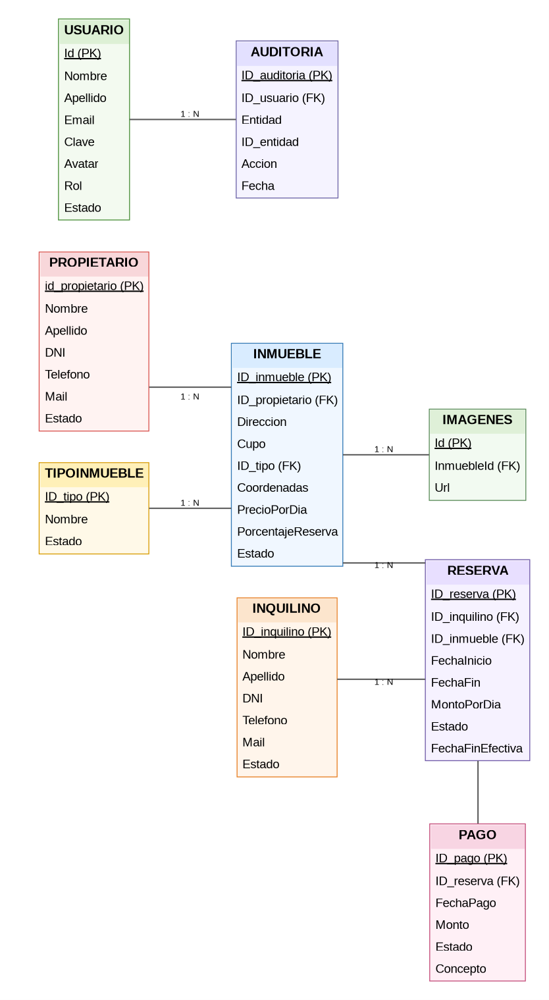

# Sistema de Gestión Inmobiliaria

> Aplicación web desarrollada con ASP.NET Core MVC para la gestión de una inmobiliaria.  
> En esta primera entrega se implementa el ABM (Alta, Baja y Modificación) de Propietarios e Inquilinos.

---

## 👥 Integrantes del Grupo

- **Antonio Tomas Assat** - GitHub: [AntonioAssat](https://github.com/AntonioAssat)
- **Ana Paula Quevedo** - GitHub: [Quevedoana](https://github.com/quevedoana)

## 🛠️ Tecnologías utilizadas

- **C#**
- **ASP.NET Core MVC**
- **.NET 10**
- **MySQL**
- **MySql.Data**
- **HTML5 / CSS3**
- **Bootstrap**
- **Vue.js**
- **DBeaver**
- **Visual Studio Code**

## 📊 Diagrama Entidad-Relación

El sistema está compuesto principalmente por las entidades:

- Usuario
- Auditoría
- Propietario
- Inmueble
- Tipo de Inmueble
- Imagen
- Inquilino
- Reserva
- Pago

## 🗄️ Configuración de la base de datos

### Requisitos

Para ejecutar el proyecto es necesario tener instalado:

- MySQL
- .NET 10 SDK

### Crear la base de datos

1. Abrir **DBeaver**, **MySQL Workbench** o una herramienta similar.
2. Conectarse al servidor MySQL.
3. Abrir el archivo `Inmobiliaria.sql`, incluido en el proyecto.
4. Ejecutar el script completo.
5. Verificar que la base de datos y sus tablas se hayan creado correctamente.

El archivo SQL contiene la estructura necesaria para ejecutar el sistema y los datos iniciales.

### Configurar la conexión

Verificar la configuración de conexión a MySQL utilizada por el proyecto.

Los datos necesarios son:

- Servidor
- Puerto
- Usuario
- Contraseña
- Base de datos

Ejemplo:

~~~text
Servidor: localhost
Puerto: 3306
Usuario: root
Contraseña: tu_contraseña
Base de datos: inmobiliaria
~~~

Si los datos de conexión son diferentes, deben modificarse según la configuración local de MySQL.

---

## 📥 Clonar el proyecto

Desde una terminal ejecutar:

~~~bash
git clone https://github.com/AntonioAssat/AnaYAntonio-ProyectoInmobiliaria.git
~~~

Ingresar a la carpeta:

~~~bash
cd AnaYAntonio-ProyectoInmobiliaria
~~~

---

## 📦 Restaurar dependencias

Ejecutar:

~~~bash
dotnet restore
~~~

---

## 🔨 Compilar el proyecto

Ejecutar:

~~~bash
dotnet build
~~~

Si la compilación finaliza correctamente, el proyecto está listo para ejecutarse.

---

## ▶️ Ejecutar el proyecto

Ejecutar:

~~~bash
dotnet run
~~~

La terminal mostrará la dirección local donde se encuentra disponible la aplicación, por ejemplo:

~~~text
https://localhost:xxxx
~~~

Abrir esa dirección en un navegador.

---

## 🔐 Usuarios de prueba

### Administrador

~~~text
Usuario: admin@inmobiliaria.com
Contraseña: 1234
Rol: Administrador
~~~

### Empleado

~~~text
Usuario: empleado@inmobiliaria.com
Contraseña: 123456
Rol: Empleado
~~~

---

## 👤 Roles

### Administrador

El administrador cuenta con acceso a las funciones administrativas del sistema, incluyendo la gestión de usuarios y las operaciones que requieren permisos de administrador.

También puede consultar la información de auditoría.

### Empleado

El empleado puede utilizar las funcionalidades correspondientes a su rol y modificar sus propios datos de perfil, contraseña y avatar.

---

## 📌 Funcionalidades principales

- Gestión de propietarios.
- Gestión de inquilinos.
- Gestión de inmuebles.
- Gestión de tipos de inmueble.
- Gestión de imágenes de inmuebles.
- Gestión de reservas.
- Control de superposición de reservas.
- Renovación de reservas.
- Finalización anticipada de reservas.
- Cálculo de multas por finalización anticipada.
- Gestión de pagos.
- Anulación de pagos.
- Reactivación de registros.
- Gestión de usuarios y roles.
- Auditoría de operaciones.
- Búsqueda server-side.
- Paginación server-side.
- Informes del sistema.

---

## 🚀 Resumen rápido

~~~bash
git clone https://github.com/AntonioAssat/AnaYAntonio-ProyectoInmobiliaria.git
cd AnaYAntonio-ProyectoInmobiliaria
dotnet restore
dotnet build
dotnet run
~~~

Antes de ejecutar la aplicación:

1. Ejecutar `Inmobiliaria.sql` en MySQL.
2. Configurar la conexión a la base de datos.
3. Ejecutar `dotnet run`.
4. Abrir en el navegador la dirección indicada por ASP.NET Core.
5. Ingresar con uno de los usuarios de prueba.
